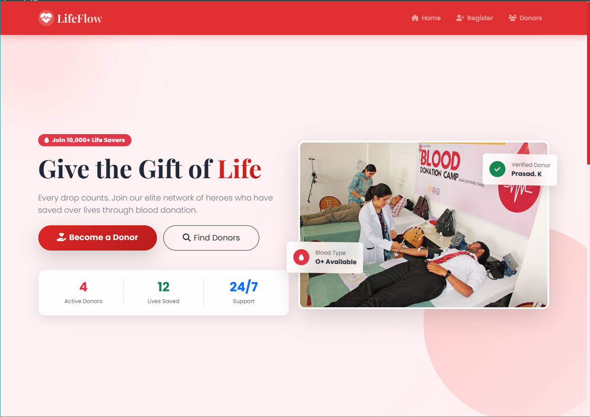
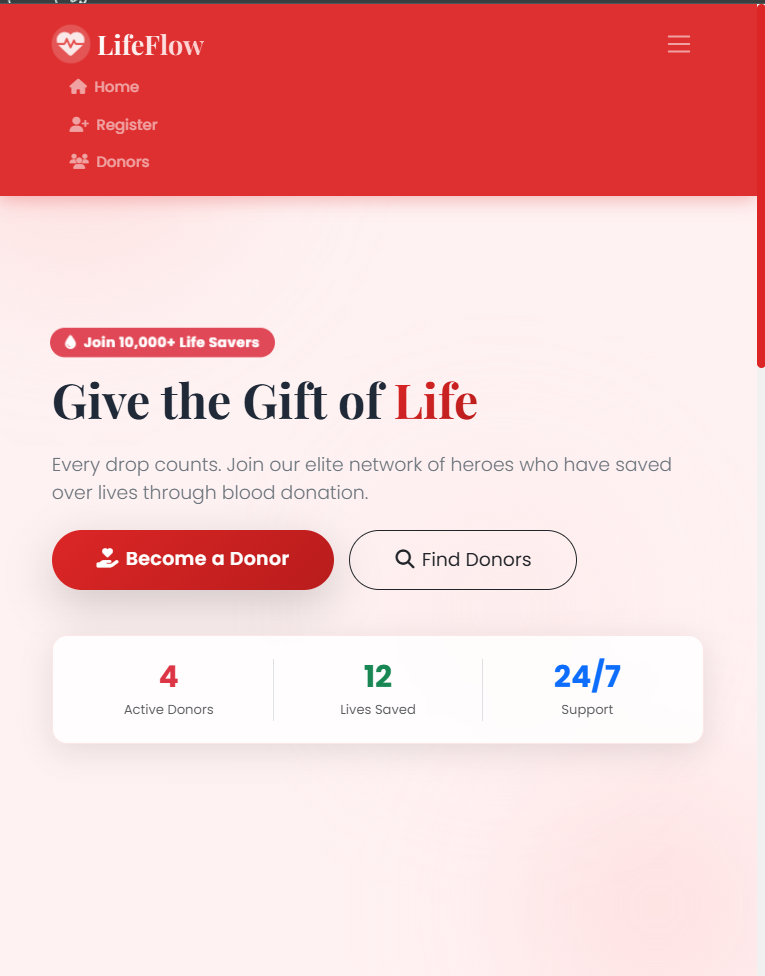
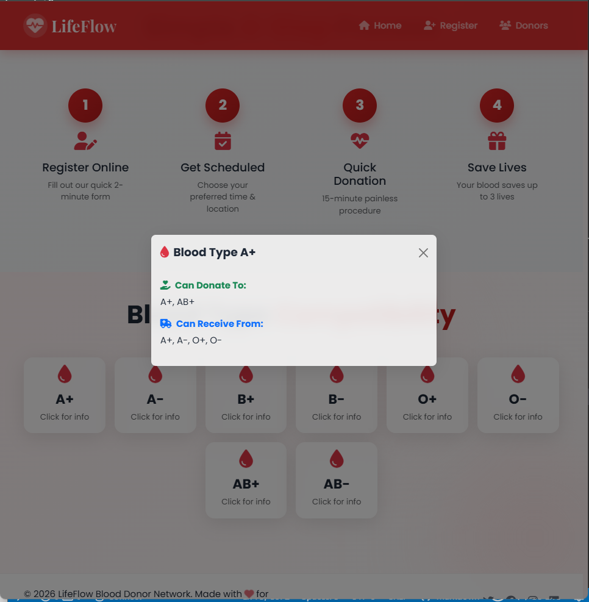
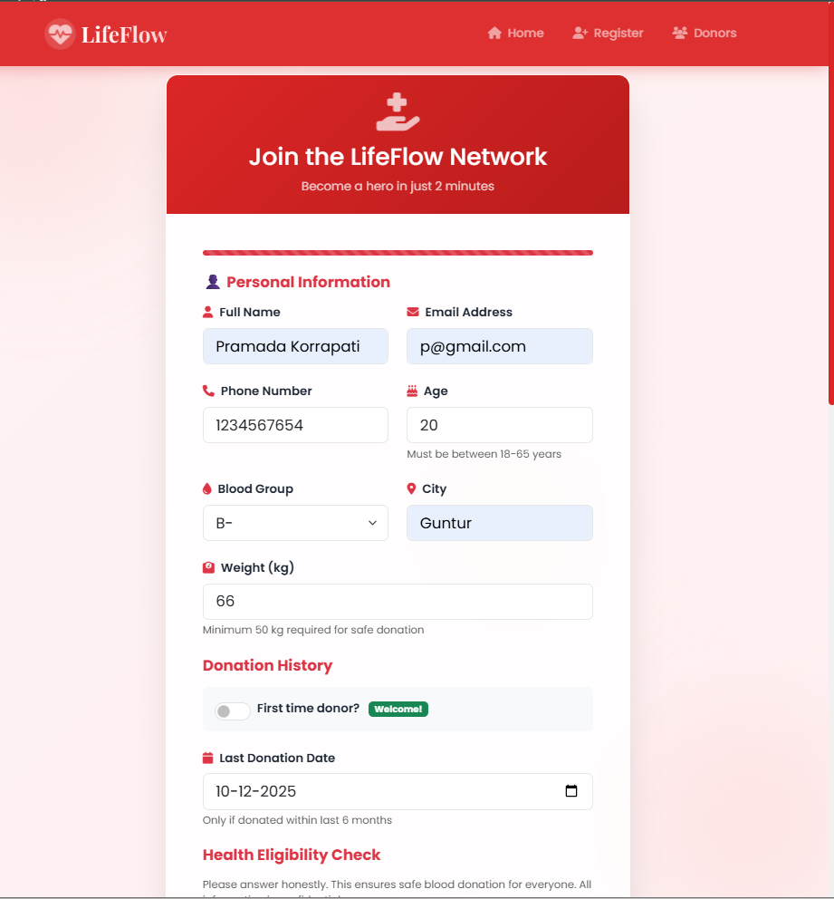
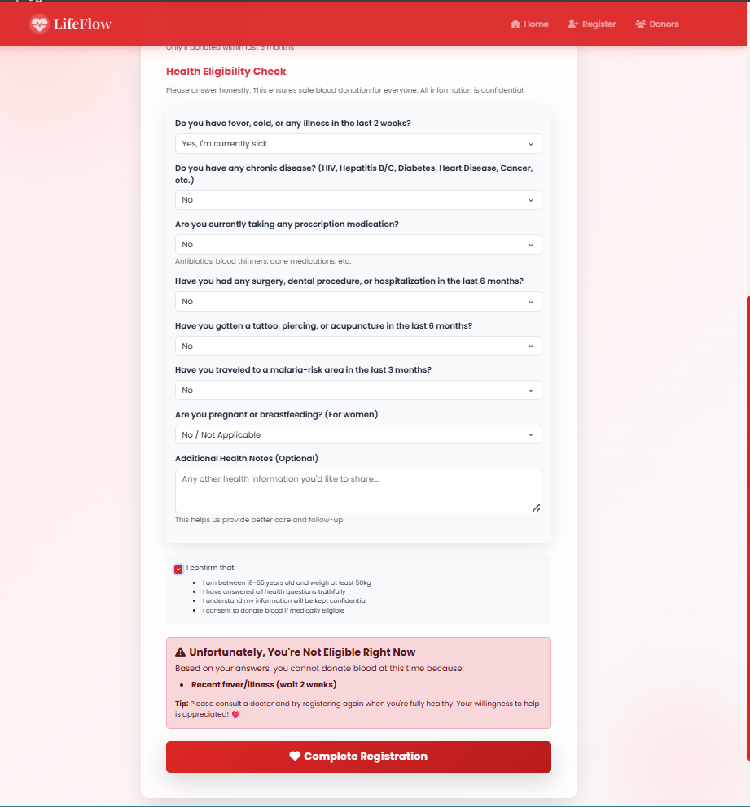
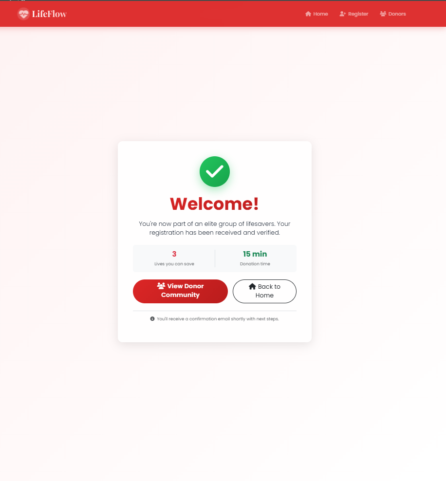
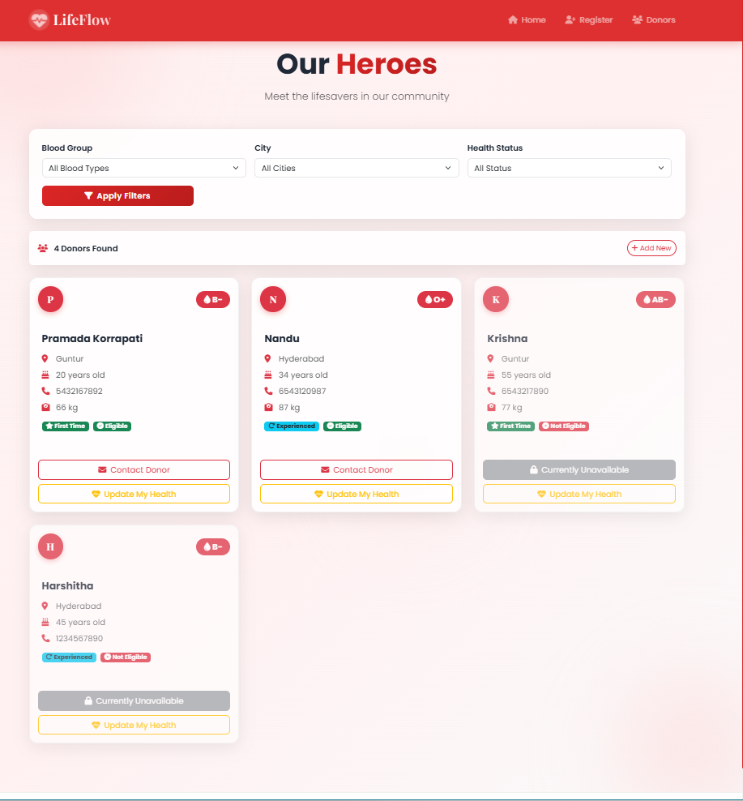
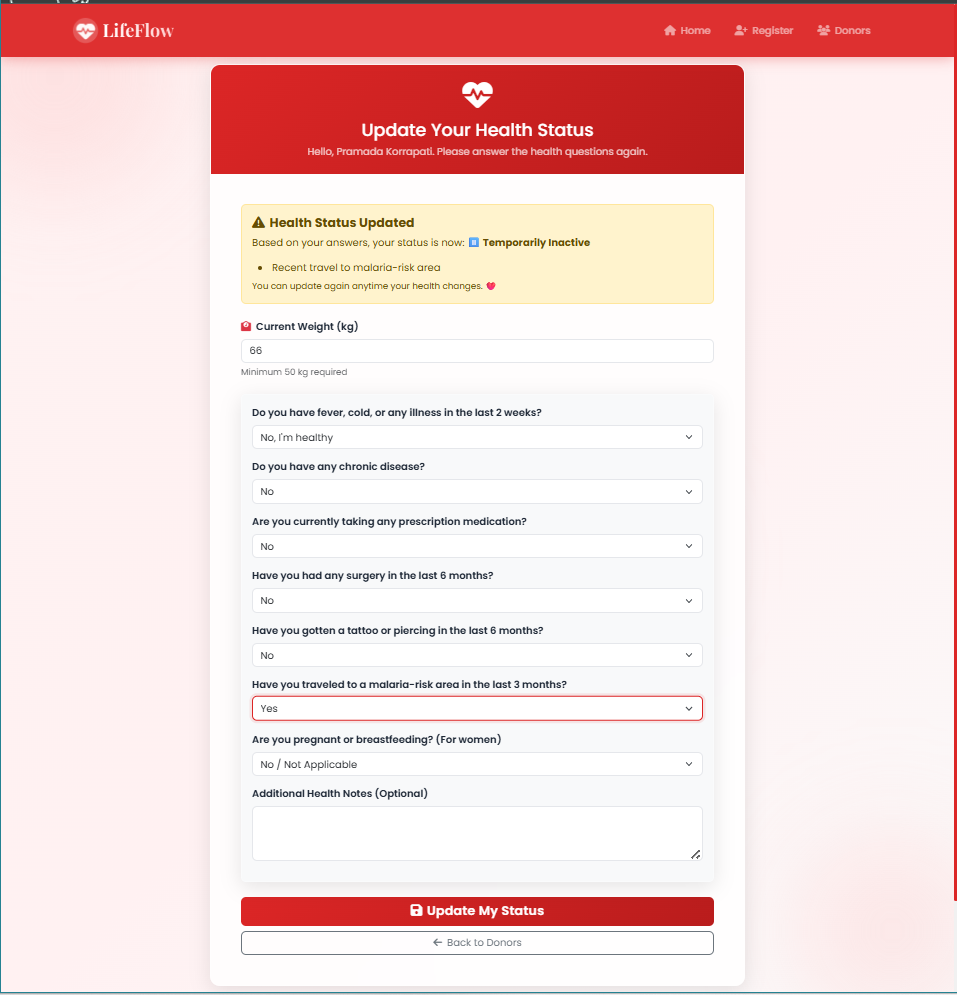

# LifeFlow – Blood Donation Network

Web application that helps connect blood donors with people who need blood — while checking basic health safety rules during registration.

## What this project does

- Lets people register as blood donors
- Asks simple health questions to decide if they can donate now
- Shows whether someone is eligible 🟢, temporarily not able 🟡, or not eligible 🔴
- Allows searching donors by blood group, city and current health status
- Lets donors update their health status later
- Shows live numbers: total donors, estimated lives helped, blood group distribution

## Main features

- Step-by-step registration form with progress bar
- Real-time field checking (age, weight, phone, email…)
- Automatic eligibility decision after health questions
- Simple card list of donors with filters
- Protected contact details (only shown with consent)
- Mobile-friendly design
- Basic statistics on home page (updated without refresh)

## Technologies used

- **Frontend**: HTML, CSS, Bootstrap 5, Font Awesome, jQuery, AOS (animations)
- **Backend**: Python + Flask
- **Database**: PostgreSQL
- **Templates**: Jinja2

## Folder structure

```
Blood-donate/
├── static/
│   ├── css/
│   │   └── style.css
│   └── js/
│       └── script.js
├── templates/
│   ├── base.html
│   ├── index.html
│   ├── register.html
│   ├── donors.html
│   ├── success.html
│   └── update_health.html
├── app.py
├── requirements.txt
├── README.md
└── screenshots/                
    ├── home.png
    ├── home_narrow.png
    ├── register.png
    ├── health_eligibility.png
    ├── donors.png
    ├── success.png
    └── update_health.png
```
## How to run the project locally

### Requirements

- Python 3.8 or newer
- PostgreSQL (version 12 or higher recommended)
- Git (optional)

### Installation

1. **Clone the repository**
   ```bash
   git clone https://github.com/YOUR_USERNAME/lifeflow-blood-donation.git
   cd lifeflow-blood-donation
   ```

2. **Install dependencies**
   ```bash
   pip install -r requirements.txt
   ```

3. **Create PostgreSQL database**
   ```sql
   CREATE DATABASE blood_donate_db;
   ```

4. **Update database credentials** in `app.py`:
   ```python
   DB_CONFIG = {
       'database': 'blood_donate_db',
       'user': 'postgres',
       'password': 'your_password',  # ← Update this
       'host': 'localhost',
       'port': 5432
   }
   ```

5. **Run the application**
   ```bash
   python app.py
   ```

6. **Visit** http://localhost:5000

---


Shows total donors, estimated lives helped, blood group chart and quick register button
with a navigation bar 


the nav bar adjusts based on the screensize


Additional information depecting the process to become a donor and helping them analyse to which groups then can donate or  receive blood from


The new user can register by providing his/her basic details


Health Eligibility check where we quilify the user to be a donor or not. Failed to meet health requirements the user registration is rejected


On successful registration the user is displayed a welcome message


Donors list shows the registered donors along with their current status
The users can apply the filters based on blood groop, Location and avalability status to find the donors 


The donors can also update their health, where the heatl eligibility questionnaire will be displayed.


## 🎬 Demo Steps

### Testing the Complete Workflow

1. **Start the Application**
   ```bash
   python app.py
   ```
   Visit http://localhost:5000

2. **Register a Healthy Donor**
   - Click "Register"
   - Fill all fields with valid data
   - Answer "No" to all health questions
   - Submit → See success page with confetti
   - Result: 🟢 Eligible donor created

3. **View & Filter Donors**
   - Click "Donors"
   - Apply blood group filter (e.g., O+)
   - Apply city filter
   - See filtered results with green badges

4. **Update Health Status**
   - Click "Update My Health" on a donor card
   - Answer "Yes" to "Recent fever"
   - Submit → See warning message
   - Return to donors → Badge changed to 🟡

5. **Test Ineligibility**
   - Register new donor with age = 16
   - See rejection: "Age must be between 18-65"
   - Try weight = 45kg → Rejected
   - Try "Chronic disease = Yes" → Not eligible

6. **Check Statistics**
   - Return to home page
   - See updated donor count
   - Verify lives saved calculation (donors × 3)

---

## 🔒 Health Eligibility Rules

| Criteria | Requirement | Impact |
|----------|------------|--------|
| **Age** | 18-65 years | ❌ Outside range = Not Eligible |
| **Weight** | ≥50 kg | ❌ Below = Not Eligible |
| **Recent Fever** | None in 2 weeks | 🟡 Yes = Temporarily Inactive |
| **Chronic Disease** | None | ❌ Yes = Not Eligible |
| **Medication** | None currently | 🟡 Yes = Temporarily Inactive |
| **Recent Surgery** | None in 6 months | 🟡 Yes = Temporarily Inactive |
| **Tattoo/Piercing** | None in 6 months | 🟡 Yes = Temporarily Inactive |
| **Malaria Travel** | None in 3 months | 🟡 Yes = Temporarily Inactive |
| **Pregnancy** | No | 🟡 Yes = Temporarily Inactive |

---

